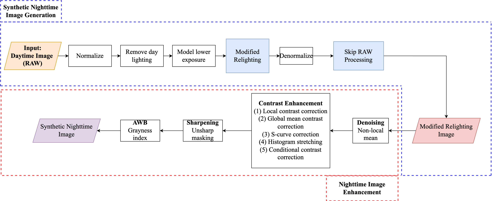
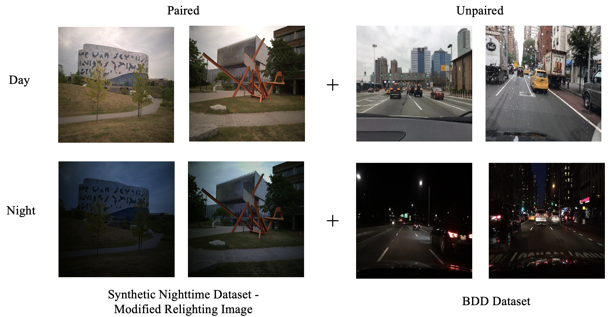
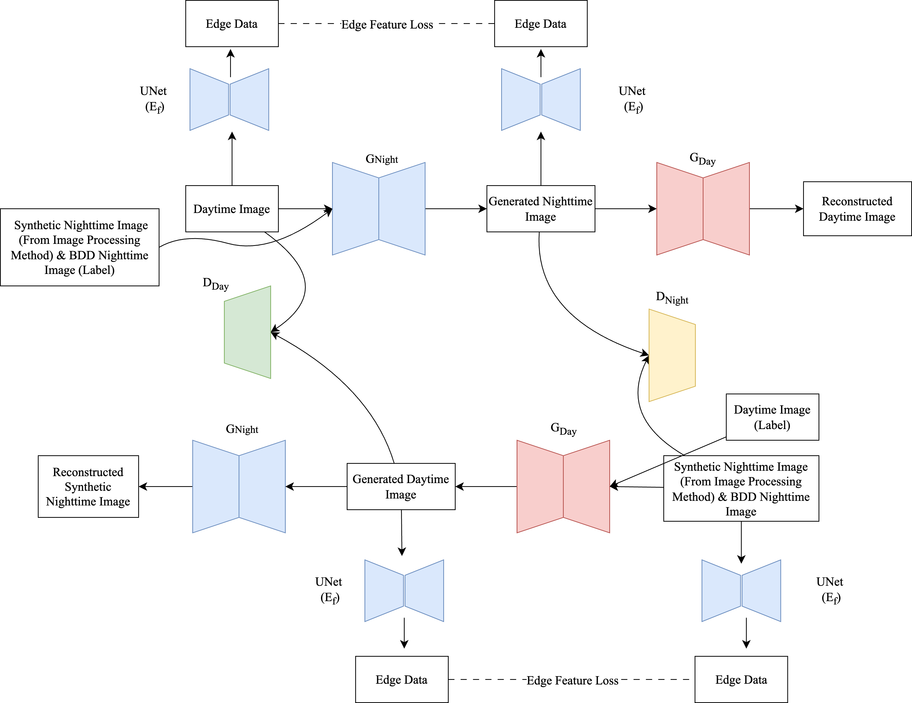

# day_to_night_comparation

The dataset used on Image Processing Approach comes from [Day-to-Night Image Synthesis for Training Nighttime Neural ISPs](https://openaccess.thecvf.com/content/CVPR2022/papers/Punnappurath_Day-to-Night_Image_Synthesis_for_Training_Nighttime_Neural_ISPs_CVPR_2022_paper.pdf). For further infromation, please read the details on paper. 

The dataset used on Deep Learning Approach comes from Berkley Deep Drive (BDD Dataset) [BDD100K: A Diverse Driving Dataset for Heterogeneous Multitask Learning](https://arxiv.org/pdf/1805.04687).

## Image Processing Approach

The synthetic images are generated using a framework of two steps, i.e., the Synthetic Nighttime Image Generation step and Nighttime Image Enhancement step. This two-step framework is illustrated below The Synthetic Nighttime Image Generation step models a lower exposure and generates a corresponding dark image. The output of this step becomes the input for the Nighttime Image Enhancement step. The Nighttime Image Enhancement step improves the nighttime quality of the overall image.

The Synthetic Nighttime Image framework is inspired from [Day-to-Night Image Synthesis for Training Nighttime Neural ISPs](https://openaccess.thecvf.com/content/CVPR2022/papers/Punnappurath_Day-to-Night_Image_Synthesis_for_Training_Nighttime_Neural_ISPs_CVPR_2022_paper.pdf). While the Nighttime Image Enhancement framework is inspired from [Back to the future: a night photography rendering ISP without deep learning](https://openaccess.thecvf.com/content/CVPR2023W/NTIRE/papers/Zini_Back_to_the_Future_A_Night_Photography_Rendering_ISP_Without_CVPRW_2023_paper.pdf). 

    

The results of our synthetic nighttime image is shown below. To ensure the results of the generated dataset is satisfactory, we evaluate each generated image using No-Reference Image Quality Assessment (NR-IQA) metrics, i.e. Fréchet Inception Distance (FID) and Structural Similarity Index Measure (SSIM) score. Each of these metrics aim to objectively score the image quality. The modified relighting image is illuminated by ambient background and randomize night illumination. Hence resulting different night illumination on specific output. The local lights from are fixed, and the artificial light does not look visually pleasing. Later, it will affect the CycleGAN mapping function. We use only the modified relighting image output for the synthetic nighttime dataset, as the other output type makes the image appear too blue and unnatural. Furthermore, it is quantitatively proven that the modified relighting image has better quality compared to the other images. For the modified relighting image, the FID and SSIM scores are 5.2 and 0.4, respectively. Meanwhile, the contrast enhancement image has the second-best quality, with FID and SSIM scores of 6.7 and 0.3, respectively.

    

## Deep Learning Approach

### Dataset
The experimental design of this research consists of performing deep image-to-image translation using a semi-supervised CycleGAN. Semi-supervised GAN usesboth paired and unpaired images. For paired data, we used the synthetic nighttime dataset. For unpaired data, we use the BDD dataset. This results in 70 paired images and 100 unpaired images, respectively, for utilizing semi-supervised CycleGAN.

    

### Generator Variation
Several deep learning CycleGAN model is built with different generator architectures to see how well it performs on generating nighttime images. In this study we compare 4 different CycleGAN architectures, i.e., original CycleGAN, FPN-CycleGAN, and UVCGAN. Additionally, we also introduce a new combination of UVCGAN with edge feature loss that will be explained later. All compared architectures are shown below.

<table><thead>
  <tr>
    <th>CycleGAN</th>
    <th>Generator</th>
  </tr></thead>
<tbody>
  <tr>
    <td>Original CycleGAN</td>
    <td>Base generator (UNet)</td>
  </tr>
  <tr>
    <td>FPN-CycleGAN </td>
    <td>Feature Pyramid Network (FPN)</td>
  </tr>
  <tr>
    <td>UVCGAN </td>
    <td>UNet-Vision Transformer (UNet-ViT)</td>
  </tr>
  <tr>
    <td>UVCGAN with Edge Feature Loss</td>
    <td>UNet-Vision Transformer (UNet-ViT)</td>
  </tr>
</tbody>
</table>

### Modified UVCGAN with Edge Feature Loss
To enhance the structural quality on the generated nighttime image of the original UVCGAN, we attempt to define loss using edge data. This edge data is computed using the Canny operator. A UNet model denoted by Ef on Figure below is fixed and obtain the edge feature to generate a proper nighttime image.

    

### Results

After training the model on the proposed datasets, several sample images were tested. The nighttime images produced using traditional image processing methods did not effectively replicate a true nighttime appearance due to variations in illumination. This inconsistency made it difficult for the model to learn stable characteristics of nighttime lighting. In contrast, the nighttime images generated from the BDD dataset appeared more realistic. This improvement was likely due to the dataset containing unpaired data, where nighttime images were captured directly by a camera rather than being artificially generated. The results of synthetic nighttime image generation using different CycleGAN generators are presented.

    

All models generated nighttime-like images except for FPN-CycleGAN, which showed inconsistent results and the highest FID score, indicating poor quality. UVCGAN with the UNet-ViT generator performed best, achieving the most realistic nighttime images and superior training scores. Although adding edge feature loss to UVCGAN aimed to enhance structural quality, it slightly worsened performance due to added complexity. Overall, UVCGAN proved the most effective for generating high-quality nighttime images. The score of training and testing on each mdoel is shown below.

<table><thead>
  <tr>
    <th rowspan="2"></th>
    <th colspan="2">FID</th>
    <th colspan="2">SSIM</th>
  </tr>
  <tr>
    <th>Train</th>
    <th>Test</th>
    <th>Train</th>
    <th>Test</th>
  </tr></thead>
<tbody>
  <tr>
    <td>Vanilla CycleGAN</td>
    <td>35,61</td>
    <td>62,54</td>
    <td>0,44</td>
    <td>0,38</td>
  </tr>
  <tr>
    <td>FPN-CycleGAN</td>
    <td>71,64</td>
    <td>104,46</td>
    <td>0,48</td>
    <td><b>0,44</b></td>
  </tr>
  <tr>
    <td>UVCGAN</td>
    <td><b>13,67</b></td>
    <td><b>16,68</b></td>
    <td><b>0,49</b></td>
    <td>0,42</td>
  </tr>
  <tr>
    <td>UVCGAN with Edge Feature Loss</td>
    <td>21,83</td>
    <td>47,79</td>
    <td>0,45</td>
    <td>0,40</td>
  </tr>
</tbody>
</table>

